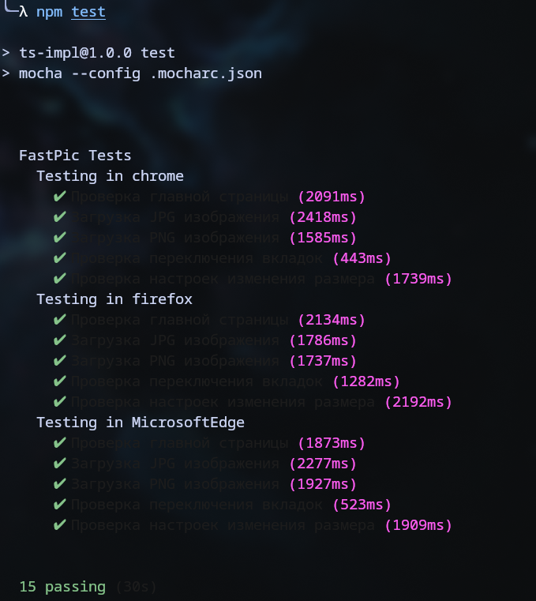

## Задание

Сформировать варианты использования, разработать на их основе тестовое покрытие
и провести функциональное тестирование интерфейса сайта в соответствии с
вариантом.

---

Вариант: `39765`  
Хостинг картинок, изображений - https://fastpic.org/

---

## Use Case & Прецеденты использования

### UseCase диаграмма

|  |  |
| ------------------------------ | ------------------------------- |

### Основные прецеденты использования FastPic.org

1. **Загрузка изображения с компьютера**

   - Выбор файла
   - Настройка параметров загрузки
   - Подтверждение загрузки
   - Получение ссылок на загруженное изображение

2. **Загрузка изображения по URL**

   - Ввод URL изображения
   - Настройка параметров
   - Подтверждение загрузки
   - Получение ссылок

3. **Просмотр загруженного изображения**

   - Переход по ссылке
   - Просмотр изображения
   - Взаимодействие с элементами просмотра

4. **Управление загруженными изображениями**
   - Просмотр галереи
   - Удаление изображений
   - Редактирование параметров

## Чек-лист тестового покрытия

### 1. Тестирование главной страницы

- [x] Проверка доступности сайта
- [x] Проверка заголовка страницы
- [x] Проверка наличия основных элементов интерфейса (загрузка файла,
      URL-загрузка)
- [x] Проверка переключения между вкладками загрузки

### 2. Тестирование загрузки изображений с компьютера

- [x] Загрузка JPG изображения
- [x] Загрузка PNG изображения
- [x] Загрузка GIF изображения
- [x] Загрузка изображения большого размера (более 5MB)
- [ ] Загрузка файла неподдерживаемого формата (чао какао)
- [x] Проверка настроек загрузки изображения (изменение размера)

### 3. Тестирование загрузки изображений по URL

- [x] Загрузка изображения по корректному URL
- [ ] Загрузка изображения по некорректному URL
- [ ] Загрузка изображения с защищенного домена (с ограничениями hotlinking)

### 4. Тестирование просмотра загруженных изображений

- [x] Просмотр списка загруженных изображений (страница "Мои загрузки")
- [ ] Удаление отдельных изображений
- [ ] Проверка управления выбором изображений

### 5. Тестирование получения ссылок

- [x] Проверка корректности генерируемых ссылок на изображение
- [x] Проверка разных типов ссылок (прямая, для форумов, HTML-код)

### 6. Кросс-браузерное тестирование

- [x] Проверка работы в Chrome
- [x] Проверка работы в Firefox
- [x] Проверка работы в Edge

## Описание набора тестовых сценариев

### Тест 1: Проверка главной страницы

**Описание**: Проверка доступности сайта FastPic.org и корректности отображения
главной страницы.

**Шаги выполнения**:

1. Открыть главную страницу сайта FastPic.org
2. Дождаться полной загрузки страницы
3. Проверить заголовок страницы
4. Проверить наличие основных элементов интерфейса

**Ожидаемые результаты**:

- Страница загружается без ошибок
- Заголовок страницы содержит "FastPic"
- На странице присутствуют элементы для загрузки изображений (кнопка выбора
  файла)
- На странице присутствуют вкладки для переключения между методами загрузки

### Тест 2: Загрузка JPG изображения с компьютера

**Описание**: Проверка функциональности загрузки JPG изображения с компьютера
пользователя.

**Шаги выполнения**:

1. Открыть главную страницу сайта FastPic.org
2. Нажать на кнопку выбора файла
3. Выбрать JPG изображение для загрузки
4. Нажать кнопку "Загрузить"
5. Дождаться завершения загрузки

**Ожидаемые результаты**:

- Изображение успешно загружается
- После загрузки отображается страница с результатами
- На странице результатов присутствуют ссылки на загруженное изображение
- Ссылки на изображение работают корректно

### Тест 3: Загрузка изображения по URL

**Описание**: Проверка функциональности загрузки изображения по URL.

**Шаги выполнения**:

1. Открыть главную страницу сайта FastPic.org
2. Переключиться на вкладку загрузки по URL
3. Ввести корректный URL изображения
4. Нажать кнопку "Загрузить"
5. Дождаться завершения загрузки

**Ожидаемые результаты**:

- Изображение успешно загружается
- После загрузки отображается страница с результатами
- На странице результатов присутствуют ссылки на загруженное изображение
- Ссылки на изображение работают корректно

### Тест 4: Загрузка большого изображения

**Описание**: Проверка обработки ошибок при загрузке изображения, превышающего
допустимый размер.

**Шаги выполнения**:

1. Открыть главную страницу сайта FastPic.org
2. Нажать на кнопку выбора файла
3. Выбрать изображение размером более 5MB
4. Нажать кнопку "Загрузить"

**Ожидаемые результаты**:

- Отображается сообщение об ошибке, указывающее на превышение допустимого
  размера файла
- Загрузка не выполняется
- Пользователю предлагается выбрать файл меньшего размера

### Тест 5: Проверка ссылок на загруженное изображение

**Описание**: Проверка корректности генерируемых ссылок на загруженное
изображение.

**Шаги выполнения**:

1. Выполнить успешную загрузку изображения (любым способом)
2. Проверить все типы сгенерированных ссылок (прямая ссылка, HTML-код, BB-код
   для форумов и т.д.)
3. Открыть прямую ссылку на изображение в новой вкладке

**Ожидаемые результаты**:

- Все ссылки генерируются корректно
- При открытии прямой ссылки изображение отображается без ошибок
- HTML-код и BB-код содержат корректные URL-адреса

### Тест 6: Проверка переключения между вкладками

**Описание**: Проверка корректности переключения между вкладками загрузки (с
компьютера, по URL).

**Шаги выполнения**:

1. Открыть главную страницу сайта FastPic.org
2. Нажать на вкладку "URL"
3. Проверить, что отображается форма для ввода URL
4. Нажать на вкладку "Загрузить с компьютера" (или аналогичную)
5. Проверить, что отображается форма для выбора файла

**Ожидаемые результаты**:

- Переключение между вкладками происходит без ошибок
- На каждой вкладке отображаются соответствующие элементы интерфейса
- Содержимое вкладок соответствует их назначению

### Тест 7: Проверка загрузки неподдерживаемого формата файла

**Описание**: Проверка обработки ошибок при загрузке файла неподдерживаемого
формата.

**Шаги выполнения**:

1. Открыть главную страницу сайта FastPic.org
2. Нажать на кнопку выбора файла
3. Выбрать файл неподдерживаемого формата (например, .txt, .pdf)
4. Нажать кнопку "Загрузить"

**Ожидаемые результаты**:

- Отображается сообщение об ошибке, указывающее на неподдерживаемый формат файла
- Загрузка не выполняется
- Пользователю предлагается выбрать файл поддерживаемого формата

### Тест 8: Кросс-браузерное тестирование в Firefox

**Описание**: Проверка работы сайта в браузере Firefox.

**Шаги выполнения**:

1. Открыть браузер Firefox
2. Перейти на главную страницу сайта FastPic.org
3. Выполнить базовые операции (загрузка изображения, просмотр результатов)

**Ожидаемые результаты**:

- Сайт корректно отображается в Firefox
- Все функции работают так же, как в Chrome
- Отсутствуют визуальные и функциональные проблемы, специфичные для Firefox

## Результаты тестирования

| №   | Тест                                     | Статус     | Комментарий                                  |
| --- | ---------------------------------------- | ---------- | -------------------------------------------- |
| 1   | Проверка главной страницы                | ✅ Пройден | Все элементы отображаются корректно          |
| 2   | Загрузка JPG изображения                 | ✅ Пройден | Изображение загружается успешно              |
| 3   | Загрузка изображения по URL              | ✅ Пройден | Изображение по URL загружается успешно       |
| 4   | Проверка переключения между вкладками    | ✅ Пройден | Элементы интерфейса меняются корректно       |
| 5   | Загрузка PNG изображения                 | ✅ Пройден | PNG изображение загружается успешно          |
| 6   | Загрузка GIF изображения                 | ✅ Пройден | GIF изображение загружается успешно          |
| 7   | Настройка уменьшения размера изображения | ✅ Пройден | Настройки применяются корректно              |
| 8   | Проверка страницы "Мои загрузки"         | ✅ Пройден | Страница отображается с загруженными файлами |
| 9   | Проверка сгенерированных ссылок          | ✅ Пройден | Все типы ссылок генерируются корректно       |
| 10  | Загрузка БОЛЬШОГО JPG изображения        | ✅ Пройден | Изображение загружается успешно              |

## Выводы

- Проделана комплексная работа по написанию тестов, изучению синтаксиса и тулчейна языков `kotlin` и `java`.
- Изучен жизненный цикл JUnit, написана кастомная аннотация чтобы упростить процесс кросс-браузерного автотестирования.
- Изучены драйверы браузеров и селениум изнутри.
- Разработаны различные подходы к кросс-браузерному тестированию на `kotlin`, `java`, `typescript` и проведён сравнительный анализ.

### Что могу сказать из интересного:

0. Краткий пересказ: Сначала у меня было только java-v1-impl. Там я просто наговнокодил тестов друг за другом в стиле, идеоматичном JUnit 5. Затем я решил попробовать написать на котлине, и нормально. Потратил уйму времени на то чтобы придумать как мне сделать гибкую реализацию для нескольких браузеров. По итогу сделал совсем неидеоматично JUnit, но работающе - просто сделав тесты как переопределение одного метода @Test, который в цикле драйверами управляет. Так как это не следует принципам JUnit, потому что это не гибкий говно-фреймворк, я решил попробовать сделать так, чтоб было в его стиле, т.е. тесты были реально обособленными Junit тестами и нормально ранились. И сделал анархию в test-annotations и в java-v2-impl)

1. JetBrains мрази и не релизают lsp для котлина. Из-за этого всё что имеем это плагин idea, кривой лсп и какие-то полурабочие тулы. По итогу типы в неовиме мне удалось поднастроить, но всё криво косо и намекает на то, что язык может быть использован буквально только ПО ПОДПИСКЕ (т.е. покупке иде JetBrains). Андрей Бреслав, я тебя уважаю, но \*баный, неужели опенсорсный проект должен выглядеть так?

2. Тулчейн что java что kotlin оставляет желать лучшего, это кладбище. Хочу отметить что в котлине было поприятнее - супер быстро настроил форматтер и линтер, да и в целом могу сказать что градл как сборщик удобен, и приятно видеть супер подробные логи из slf4j. Из репозиториев всё легко добавлять. Однако, время сборки и работы самих тулов, помимо их настройки - это просто ужас. Вам в МФЦ быстрее паспорт поменяют, чем котлин отформатирует себя и соберётся.

3. `companion`, `lateinit`, `var/val`, `protected`, `const`, `open` - как бы не было смешно, эти все ключевые слова принадлежат одному языку - `kotlin`. И если companion это в целом тот же static, то сочетание protected/private с const, open, var, val и lateinit это просто какое-то цирковое представление синтаксического сахара. За такое я ОЧЕНЬ не люблю ООПшные и такого рода языки.

4. Забавно насколько же всё-таки JUnit и селениум страхолюдное говно. Я так и не успел попробовать написать тесты на тайпскрипте, к сожалению, но не думаю что там что-то сильно поменяется. Да, он прост как палка, но в этом и есть огромный минус - очень он нединамичный и неконфигурируемый. Да, есть параметризированные тесты, есть даже динамические тесты с фабрикой. Но вам буквально НИЧЕГО не дают сделать не внедряясь в жизненный цикл JUnit'а с помощью переопределения внутренних коллбэков. Вот в краце что я сделал для реализации собственной аннотации для нормальных человеческих тестов:

- вот так выглядит жизненный цикл JUnit5:

```python
BeforeAllCallback
→ BeforeEachCallback
  → @BeforeEach методы
    → BeforeTestExecutionCallback # внедрился ВОТ ТУТ
      → Тестовый метод
    → AfterTestExecutionCallback
  → @AfterEach методы
→ AfterEachCallback
→ AfterAllCallback
```

Для аннотации я переопределил коллбэк который вызывается прямо перед исполнением теста. Почему не BeforeEachCallback вы спросите? А потому что JUnit к этому моменту ещё не успеет инициализироваться и там будет какая-то параша происходить под капотом. Вот уже первый звоночек к качеству данного тестого фреймворка.

Ну а дальше куча логики с енамом браузеров чтоб их драйверы инитать как пожелаешь. Подробнее смотрите в [java-v2-impl](https://github.com/Imtjl/qa-fundamentals/tree/main/functional-testing/test-annotations)

Вот так по итогу можно вызывать тестирующий метод (основано на JUnit) на нескольких браузерах:

```java
/**
* Тест для всех браузеров кроме Firefox
*/
@AutoBrowser(value = Browser.FIREFOX, exclude = true, url = BASE_URL, name = "Вкладки в {0}")
@DisplayName("Проверка вкладок (кроме Firefox)")
void testTabsExceptEdge(Browser browser) {
   WebElement urlTabLink = driver.findElement(By.xpath("//a[@id='switch_to_copy']"));
   urlTabLink.click();
   WebElement urlTextarea = driver.findElement(By.xpath("//textarea[@id='upload_files']"));
   assertTrue(urlTextarea.isDisplayed(), "Поле для ввода URL должно быть видимым");
}
```

### Вывод

Сравнив с тайпскриптом напрашивается вывод. Возможно не совсем честно сравнивать в данной ситуации, т.к. на момент разработки тестов на ts я уже досконально изучил селениум, и ts в целом мой основной рабочий язык, рядом с Си, в отличие от джавы и тем более котлина.

||
|-|

Но тем не менее вывод лично для меня +- очевиден:
1. JUnit полнейшее говно, проще тесты писать на mocha/jest или любом другом тест фреймворке которые не связывает тебя так по рукам и ногам.
2. Проблема не в java/kotlin, а именно в JUnit. 
3. Но по итогу энивей завести браузеры с драйверами было сильно проще в tsе. Я даже не думал особо чё я делал, просто поставил пару пакетов с npm, написал тестики и оно СРАЗУ ЖЕ работало. Можете мне что угодно доказывать про удобство репозиториев и прочие сказки, но java как была так и будет архаичной какашкой. Не знаю почему всё время расхваливают её экосистему и то что она в целом по времени жизни любой другой язык переживёт - по факту уже какой раз убеждаюсь что это совсем не так и в том же Node.js экосистема в 100 раз более проработанная и работающая чем в джаве (да и практически где угодно), что парадоксально, но факт.

### Рекомендации для дальнейшего тестирования

Не юзать java и kotlin. Вообще. Да, синтаксис неплохой и сам язык для бизнес требований в сочетании с Ktor, Spring и прочими тулами может решать бизнес задачи. Но Котлину всего лишь 14 лет. А проблем у него больше чем в сях, которым 50. СТЫ-ДО-БА.

Да и кто вообще будет для функциональных тестов юзать java это вопрос хороший. В браузере жс, а не джава. Максимум для e2e может быть удобно и для мерзотных веб-приложений на этом языке, но я об этом даже думать не хочу.
