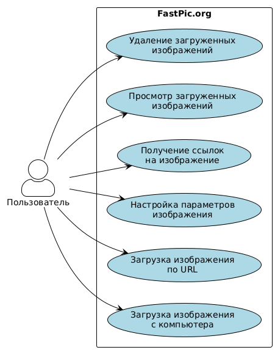

## Задание

Сформировать варианты использования, разработать на их основе тестовое покрытие
и провести функциональное тестирование интерфейса сайта в соответствии с
вариантом.

---

Вариант: `39765`  
Хостинг картинок, изображений - https://fastpic.org/

---

## Use Case & Прецеденты использования

### UseCase диаграмма

|  |  |
| ------------------------------ | ------------------------------- |

### Основные прецеденты использования FastPic.org

1. **Загрузка изображения с компьютера**

   - Выбор файла
   - Настройка параметров загрузки
   - Подтверждение загрузки
   - Получение ссылок на загруженное изображение

2. **Загрузка изображения по URL**

   - Ввод URL изображения
   - Настройка параметров
   - Подтверждение загрузки
   - Получение ссылок

3. **Просмотр загруженного изображения**

   - Переход по ссылке
   - Просмотр изображения
   - Взаимодействие с элементами просмотра

4. **Управление загруженными изображениями**
   - Просмотр галереи
   - Удаление изображений
   - Редактирование параметров

## Чек-лист тестового покрытия

### 1. Тестирование главной страницы

- [x] Проверка доступности сайта
- [x] Проверка заголовка страницы
- [x] Проверка наличия основных элементов интерфейса (загрузка файла,
      URL-загрузка)
- [x] Проверка переключения между вкладками загрузки

### 2. Тестирование загрузки изображений с компьютера

- [x] Загрузка JPG изображения
- [x] Загрузка PNG изображения
- [x] Загрузка GIF изображения
- [x] Загрузка изображения большого размера (более 5MB)
- [ ] Загрузка файла неподдерживаемого формата (чао какао)
- [x] Проверка настроек загрузки изображения (изменение размера)

### 3. Тестирование загрузки изображений по URL

- [x] Загрузка изображения по корректному URL
- [ ] Загрузка изображения по некорректному URL
- [ ] Загрузка изображения с защищенного домена (с ограничениями hotlinking)

### 4. Тестирование просмотра загруженных изображений

- [x] Просмотр списка загруженных изображений (страница "Мои загрузки")
- [ ] Удаление отдельных изображений
- [ ] Проверка управления выбором изображений

### 5. Тестирование получения ссылок

- [x] Проверка корректности генерируемых ссылок на изображение
- [ ] Проверка кнопки копирования ссылок в буфер обмена
- [x] Проверка разных типов ссылок (прямая, для форумов, HTML-код)

### 6. Кросс-браузерное тестирование

- [x] Проверка работы в Chrome
- [ ] Проверка работы в Firefox

## Описание набора тестовых сценариев

### Тест 1: Проверка главной страницы

**Описание**: Проверка доступности сайта FastPic.org и корректности отображения
главной страницы.

**Шаги выполнения**:

1. Открыть главную страницу сайта FastPic.org
2. Дождаться полной загрузки страницы
3. Проверить заголовок страницы
4. Проверить наличие основных элементов интерфейса

**Ожидаемые результаты**:

- Страница загружается без ошибок
- Заголовок страницы содержит "FastPic"
- На странице присутствуют элементы для загрузки изображений (кнопка выбора
  файла)
- На странице присутствуют вкладки для переключения между методами загрузки

### Тест 2: Загрузка JPG изображения с компьютера

**Описание**: Проверка функциональности загрузки JPG изображения с компьютера
пользователя.

**Шаги выполнения**:

1. Открыть главную страницу сайта FastPic.org
2. Нажать на кнопку выбора файла
3. Выбрать JPG изображение для загрузки
4. Нажать кнопку "Загрузить"
5. Дождаться завершения загрузки

**Ожидаемые результаты**:

- Изображение успешно загружается
- После загрузки отображается страница с результатами
- На странице результатов присутствуют ссылки на загруженное изображение
- Ссылки на изображение работают корректно

### Тест 3: Загрузка изображения по URL

**Описание**: Проверка функциональности загрузки изображения по URL.

**Шаги выполнения**:

1. Открыть главную страницу сайта FastPic.org
2. Переключиться на вкладку загрузки по URL
3. Ввести корректный URL изображения
4. Нажать кнопку "Загрузить"
5. Дождаться завершения загрузки

**Ожидаемые результаты**:

- Изображение успешно загружается
- После загрузки отображается страница с результатами
- На странице результатов присутствуют ссылки на загруженное изображение
- Ссылки на изображение работают корректно

### Тест 4: Загрузка большого изображения

**Описание**: Проверка обработки ошибок при загрузке изображения, превышающего
допустимый размер.

**Шаги выполнения**:

1. Открыть главную страницу сайта FastPic.org
2. Нажать на кнопку выбора файла
3. Выбрать изображение размером более 5MB
4. Нажать кнопку "Загрузить"

**Ожидаемые результаты**:

- Отображается сообщение об ошибке, указывающее на превышение допустимого
  размера файла
- Загрузка не выполняется
- Пользователю предлагается выбрать файл меньшего размера

### Тест 5: Проверка ссылок на загруженное изображение

**Описание**: Проверка корректности генерируемых ссылок на загруженное
изображение.

**Шаги выполнения**:

1. Выполнить успешную загрузку изображения (любым способом)
2. Проверить все типы сгенерированных ссылок (прямая ссылка, HTML-код, BB-код
   для форумов и т.д.)
3. Открыть прямую ссылку на изображение в новой вкладке

**Ожидаемые результаты**:

- Все ссылки генерируются корректно
- При открытии прямой ссылки изображение отображается без ошибок
- HTML-код и BB-код содержат корректные URL-адреса

### Тест 6: Проверка переключения между вкладками

**Описание**: Проверка корректности переключения между вкладками загрузки (с
компьютера, по URL).

**Шаги выполнения**:

1. Открыть главную страницу сайта FastPic.org
2. Нажать на вкладку "URL"
3. Проверить, что отображается форма для ввода URL
4. Нажать на вкладку "Загрузить с компьютера" (или аналогичную)
5. Проверить, что отображается форма для выбора файла

**Ожидаемые результаты**:

- Переключение между вкладками происходит без ошибок
- На каждой вкладке отображаются соответствующие элементы интерфейса
- Содержимое вкладок соответствует их назначению

### Тест 7: Проверка загрузки неподдерживаемого формата файла

**Описание**: Проверка обработки ошибок при загрузке файла неподдерживаемого
формата.

**Шаги выполнения**:

1. Открыть главную страницу сайта FastPic.org
2. Нажать на кнопку выбора файла
3. Выбрать файл неподдерживаемого формата (например, .txt, .pdf)
4. Нажать кнопку "Загрузить"

**Ожидаемые результаты**:

- Отображается сообщение об ошибке, указывающее на неподдерживаемый формат файла
- Загрузка не выполняется
- Пользователю предлагается выбрать файл поддерживаемого формата

### Тест 8: Кросс-браузерное тестирование в Firefox

**Описание**: Проверка работы сайта в браузере Firefox.

**Шаги выполнения**:

1. Открыть браузер Firefox
2. Перейти на главную страницу сайта FastPic.org
3. Выполнить базовые операции (загрузка изображения, просмотр результатов)

**Ожидаемые результаты**:

- Сайт корректно отображается в Firefox
- Все функции работают так же, как в Chrome
- Отсутствуют визуальные и функциональные проблемы, специфичные для Firefox

## Результаты тестирования

| №   | Тест                                     | Статус     | Комментарий                                  |
| --- | ---------------------------------------- | ---------- | -------------------------------------------- |
| 1   | Проверка главной страницы                | ✅ Пройден | Все элементы отображаются корректно          |
| 2   | Загрузка JPG изображения                 | ✅ Пройден | Изображение загружается успешно              |
| 3   | Загрузка изображения по URL              | ✅ Пройден | Изображение по URL загружается успешно       |
| 4   | Проверка переключения между вкладками    | ✅ Пройден | Элементы интерфейса меняются корректно       |
| 5   | Загрузка PNG изображения                 | ✅ Пройден | PNG изображение загружается успешно          |
| 6   | Загрузка GIF изображения                 | ✅ Пройден | GIF изображение загружается успешно          |
| 7   | Настройка уменьшения размера изображения | ✅ Пройден | Настройки применяются корректно              |
| 8   | Проверка страницы "Мои загрузки"         | ✅ Пройден | Страница отображается с загруженными файлами |
| 9   | Проверка сгенерированных ссылок          | ✅ Пройден | Все типы ссылок генерируются корректно       |
| 10  | Загрузка БОЛЬШОГО JPG изображения        | ✅ Пройден | Изображение загружается успешно              |

## Выводы

Скажу устно

### Рекомендации для дальнейшего тестирования:

не юзать java
