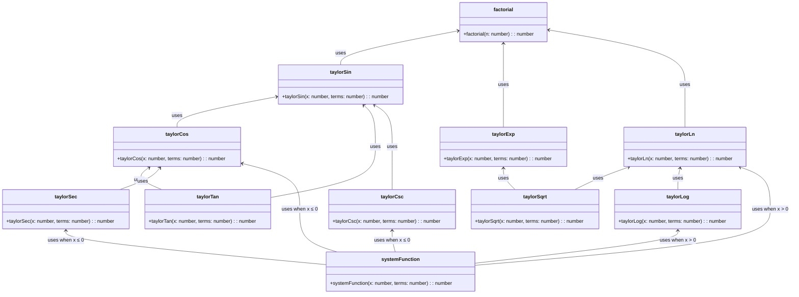

## Maths behind this bs

$$
\begin{cases}
\left( \left( csc(x) - sec(x)\right) - cos(x) \right) & \text{if } x \leq 0 \\
\left( \frac{ \left( \log_5(x) - \ln(x) \right)^4 \cdot \left( \log_5(x) + \log_3(x) \right)^3 }{\log_{10}(x) \cdot ln(x)} \right) & \text{if } x > 0
\end{cases}
$$

## Class diagram

